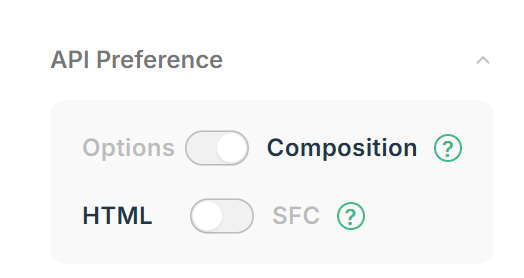

# Module 02 - Ma première application

## Prise en main de vue
Hello World :
https://vuejs.org/examples/#hello-world


## Choix du code
4 choix possible :
 - Options + HTML
 - Options + SFC
 - Compostion + HTML
 - Composition + SFC 
 

  
 Notre choix : <code>Composition</code>  +  <code>HTML</code>
Les formulaires :
https://vuejs.org/examples/#form-bindings
  
la documentation des formulaires:  
https://vuejs.org/guide/essentials/forms.html
## :one: Afficher une variable

Charger le CDN de Vue
```html
<script src="https://unpkg.com/vue@3/dist/vue.global.js"></script>
```

Le premier code Vue
Nous utilisons un référence pour stocker une variable
```html
<script  type="module">
const { createApp, ref } = Vue
  createApp({
    setup() {
        const message = ref('Hello vue!')
        return {
          message
        }
      }
  }).mount('#app')
</script>
```

La partie HTML
```html
<div id="app">{{ message }}</div>
```

Le code complet
--------------
```html
<div id="app">{{ message }}</div>

<script src="https://unpkg.com/vue@3/dist/vue.global.js"></script>
<script  type="module">
const { createApp, ref } = Vue
  createApp({
    setup() {
        // je déclare une variable comme reference
        const message = ref('Hello vue!')
        return {
          message // ne pas oublier de passer la reference ds le return
        }
      }

  }).mount('#app')
</script>
```
--------------


# :two: Le trigger : un bouton
:warning: Bien mettre le bouton dans la div #app

```html
<div id="app">
  {{ message }}
<button @click="afficher()">GO</button>

</div>

<script src="https://unpkg.com/vue@3/dist/vue.global.js"></script>
<script  type="module">

const { createApp, ref } = Vue
  createApp({
    setup() {
        const message = ref('Hello vue!')
        const afficher =()=>  {
            console.log('afficher')
        }
        return {
          message,
          afficher
        }
      }

  }).mount('#app')
</script>
```

Afficher et mofifier une reference
```html
<script  type="module">

const { createApp, ref } = Vue
  createApp({
    setup() {
        const message = ref('Hello vue!')
        const afficher =()=>  {
            // afficher et mofifier une reference
            message.value='ola!'
        }
        return {
          message,
          afficher
        }
      }

  }).mount('#app')
</script>
```

# :three: Lire une saisie utilisateur avec input
Première application avec traitement : Mettre le champs saisi en majuscule

On vient "binder" le champ input avec l'attribut <code>v-model</code>  
documentation : https://vuejs.org/examples/#form-bindings
  
```html
<div id="app">
    
    <input v-model="info">
    <button @click="afficher">GO</button>
    {{ message }}
</div>

<script src="https://unpkg.com/vue@3/dist/vue.global.js"></script>
<script  type="module">

const { createApp, ref } = Vue
  createApp({
    setup() {
        // déclarer une reference
        const info = ref('test')
        const message = ref('Hello vue!')
        const afficher =()=>  {
            // afficher et mofifier une reference
            message.value=info.value.toUpperCase()
        }
        return {
          info, // ne pas oublier de passer la reference ds le return
          message,
          afficher
        }
      }
  }).mount('#app')
</script>
```

