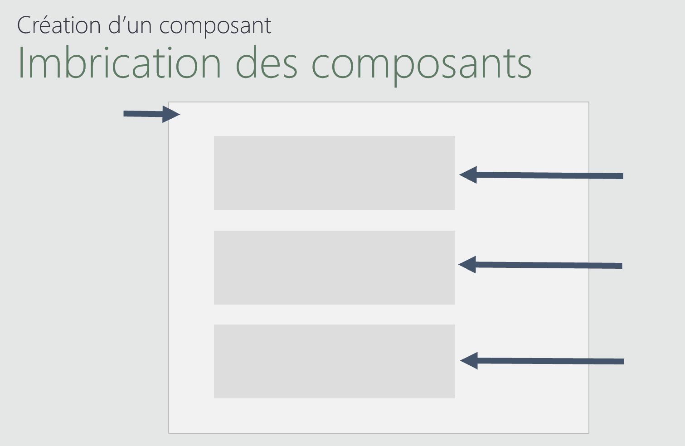
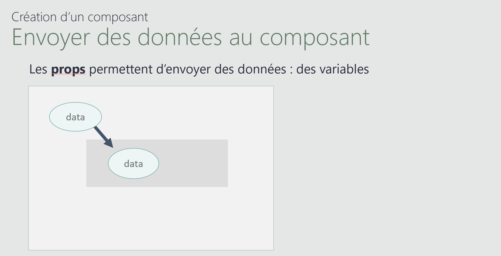
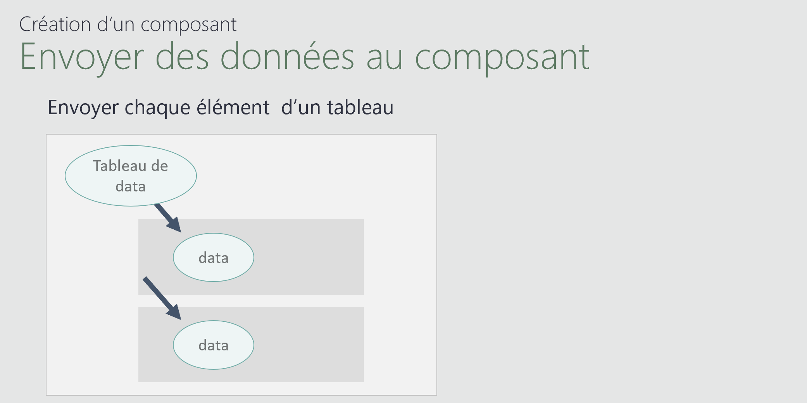
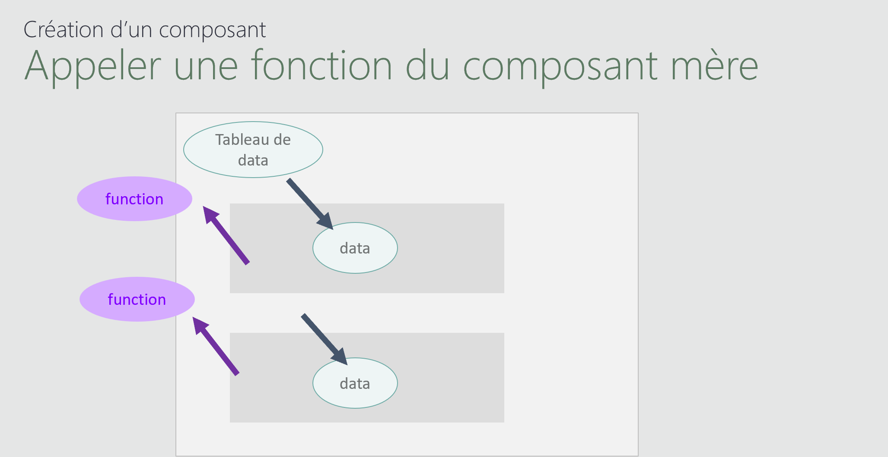

# Module 09 - Création d'un composant

un exemple simple :  
https://vuejs.org/examples/#simple-component

la documentation :  
https://vuejs.org/guide/essentials/component-basics.html
  


Création du fichier <code>FilmComponent.js</code>
**FilmComponent.js**
```js
export default{
    template: `<h1> Film Component</h1>`,
}
```

**HTML** :
```html
<div id="app">
  <film-component />
</div>

<script src="https://unpkg.com/vue@3/dist/vue.global.js"></script>
<script type="module">
  const { createApp, ref } = Vue;
  import FilmComponent from "./FilmComponent.js";

  createApp({
    components: {
      FilmComponent,
    },
    setup() {
      return {
      };
    },
  }).mount("#app");
</script>
```

## les props



Nous allons envoyer des props à notre composant :
**FilmComponent.js**
```js
export default{
    props: {
        titre : String,
        annee: String,
      },

    template: `<h1>  {{titre}} {{annee}}</h1>`,
}
```

**HTML** :
```html
  <film-component titre="titre" annee="annee" />
```

## Appeler plusieurs composants


**FilmComponent.js**
```js
export default{
    props: {
        film : Object,
        indice: Number ,
      },
     
    template: `<h1>  {{film.titre}} {{film.annee}}</h1>`,
}
```
**HTML** :
```html
<div id="app">
  <film-component v-for="(film,i) in films" :film="film" :key="film.id" :indice="i" />
</div>

<script src="https://unpkg.com/vue@3/dist/vue.global.js"></script>
<script type="module">
  const { createApp, ref } = Vue;
  import FilmComponent from "./FilmComponent.js";

  createApp({
    components: {
      FilmComponent,
    },

    setup() {
        const films = ref(
            [
                {id:42,titre: "The Matrix", annee: "1999",},
                {id:24,titre: "Star Wars", annee: "1977",},
                {id:36,titre: "Pulp Fiction", annee: "1994"},
            ]
            )
      return {
        films
      };
    },
  }).mount("#app");
</script>
```
## Envoyer un reférénce de fonction



**FilmComponent.js**
```js
export default{
    props: {
        film : Object,
        indice: Number ,
        qui: Function
      },

    template: `<h1>  {{film.titre}} {{film.annee}}</h1> 
                <button @click="qui(indice)">go</button>`,
}
```

**HTML** :
```html
<div id="app">
  <film-component v-for="(film,i) in films" :film="film" :key="film.id" :indice="i" :qui="qui" />
</div>

<script src="https://unpkg.com/vue@3/dist/vue.global.js"></script>
<script type="module">
  const { createApp, ref } = Vue;
  import FilmComponent from "./FilmComponent.js";

  createApp({
    components: {
      FilmComponent,
    },

    setup() {
        const films = ref(
            [
                {id:42,titre: "The Matrix", annee: "1999",},
                {id:24,titre: "Star Wars", annee: "1977",},
                {id:36,titre: "Pulp Fiction", annee: "1994"},
            ]
            )
        const qui=(i)=>{
            console.log(films.value[i]);
        }
      return {
        films,
        qui
      };
    },
  }).mount("#app");
</script>
```