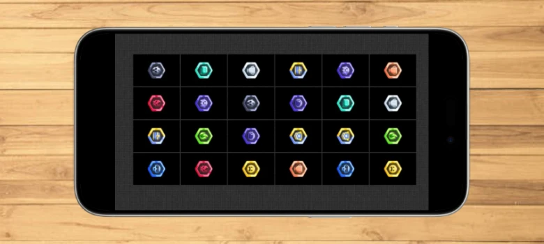

# TP CHARLIE Le jeux memory
**Live preview**  :    
[Tester le TP Charlie](https://www.sevenvalley.fr/tp-javascript/tpc)  


Vous avez la maquette dans le répertoire <code>maquette</code> 
:warning: Pensez à ne pas mettre bootstrap  
## Créer un jeux pour téléphone portable !

- Créer un tableau 1 de 12 entier (de 0 à 11)    
- Créer un tableau 2 : d'entier d'une longueur de 24   
contenant 2 fois des entiers de 0 à 11
- Vous devez créer le tableau 2 en concaténant le tableau 1 ( tab2 = tab1 + tab1)  
- Mélanger ce tableau  
- Afficher les images correspondant au nombre dans le tableau  
- Effacer une image lors d'un clique  
- Effacer les 2 mêmes images  
- Eviter le bug lorsque je clique 2 fois sur la mmême image  
- Afficher gagner à la Fin  
- Afficher le nombre de secondes de jeux  
- Relancer la partie  


**tableau 1 : de 12 entier**  
| **indice** | 0 | 1 | 2 |3 | 4 | 5 | 6 | 7 | 8 | 9 | 10 | 11 |
|:-: |:-: |:-: |:-: |:-: |:-: |:-: |:-: |:-: |:-: |:-: |:-: |:-: |
| **valeur** | 0 | 1 | 2 | 3 | 4 | 5 | 6 | 7 | 8 | 9 | 10 | 11 |  

**tableau 2 de longueur 24 entier**  

| **indice** | 0 | 1 | 2 |3 | 4 | 5 | 6 | 7 | 8 | 9 | 10 | 11 | 12 | 13 | 14 | 15 | 16 | 17 | 18 | 19 | 20 | 21 | 21 | 23 |
|:-: |:-: |:-: |:-: |:-: |:-: |:-: |:-: |:-: |:-: |:-: |:-: |:-: |:-: |:-: |:-: |:-: |:-: |:-: |:-: |:-: |:-: |:-: |:-: |:-: |
| **valeur** | 0 | 1 | 2 | 3 | 4 | 5 | 6 | 7 | 8 | 9 | 10 | 11 |  0 | 1 | 2 | 3 | 4 | 5 | 6 | 7 | 8 | 9 | 10 | 11 | 


Objetif ajouter une carte au code HTML :

```html
<body>
  <div class="container">
    <!-- Inserer les balises ICI -->
  </div>
  <script src="jeux.js"></script>
</body>
```
 Ajouter une tuile
 ```html
<body>

  <div class="container">
    <div></div>
  </div>
  
  <script src="jeux.js"></script>
</body>
```

 Selectionner une tuile une tuile  
 <code>class="green"</code>
 ```html
<body>

  <div class="container">
    <div class="green"></div>
  </div>
  
  <script src="jeux.js"></script>
</body>
```

La fonction pour mélanger un tableau :heart_eyes::
```js
//-----------------------------------------------
function melanger(tab) {
  let tab2 = [];
  for (let i = 0; i < tab.length; i++) {
    do {
      // je genere un nb alea de 0 à taille du tableau
      x = Math.floor(Math.random() * tab.length);
    } while (tab2[x] != undefined);
    // tant que l'emplacement n'est pas vide
	tab2[x]= tab[i];
  }
  
  return tab2;
}
//-----------------------------------------------
```